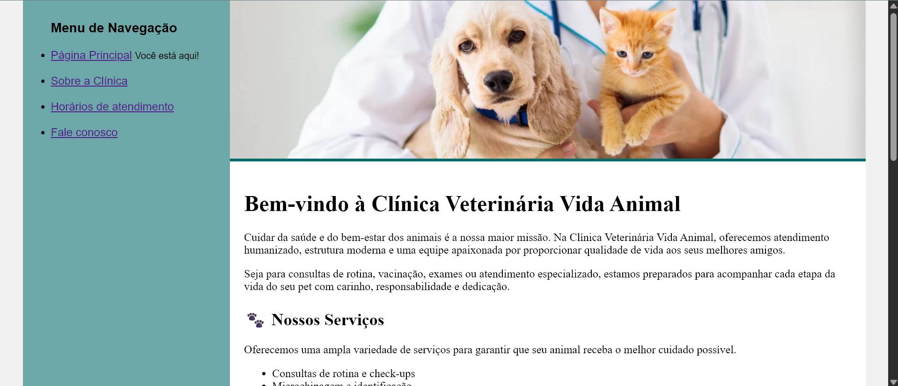

# 🐾 Vida Animal Veterinary Clinic

This project was developed as part of the **HTML Module II** from the **DIO (Digital Innovation One) HTML Track**, with the goal of practicing fundamental HTML concepts by building an institutional website for a fictional veterinary clinic.

The website was built using only **HTML5** and **CSS3**, focusing on semantic HTML, proper page structure, and the core concepts covered throughout the course.

---

## 📸 Preview



---

## 📖 About the Project

**Vida Animal Veterinary Clinic** is a fictional institutional website composed of multiple interconnected pages, simulating the online presence of a real veterinary clinic.

Throughout the development, fundamental HTML concepts were applied, including semantic structure, navigation, tables, forms, images, and embedded maps.

---

## ✨ Features

- 🏠 Home page introducing the clinic
- 🐶 About the Clinic page
- 🕒 Business hours page
- 💲 Services table
- 📞 Contact page
- 📝 Contact form
- 🗺️ Embedded Google Maps location
- 🖼️ Custom banners for each page
- 📱 Navigation menu linking all pages

---

## 🛠️ Technologies

- HTML5
- CSS3

---

## 📚 Concepts Practiced

This project explores several core HTML concepts, including:

- Semantic HTML structure
- Hyperlinks and navigation
- Unordered lists
- Images
- Tables
- Forms
- Iframes
- File organization
- Separation of structure (HTML) and presentation (CSS)

---

## 📂 Project Structure

```text
.
├── assets/
│   └── images/
├── index.html
├── about.html
├── business-hours.html
├── contact.html
├── base.css
├── LICENSE
└── README.md
```

---

## 🎯 Learning Objectives

The main goal of this project was to reinforce the fundamental concepts of HTML by developing a complete static website using only the technologies introduced up to this point in the course.

---

## 🌐 Live Demo

👉 https://E-ternalSpring.github.io/html-vet-clinic-website/

---

## 🚀 Getting Started

Since this is a static website, simply open the `index.html` file in any modern web browser.

For a better development experience, you can also use the **Live Server** extension in Visual Studio Code.

---

## 📄 License

This project is licensed under the MIT License. See the `LICENSE` file for more information.

---

Developed as part of the **DIO HTML Track** for learning purposes.
